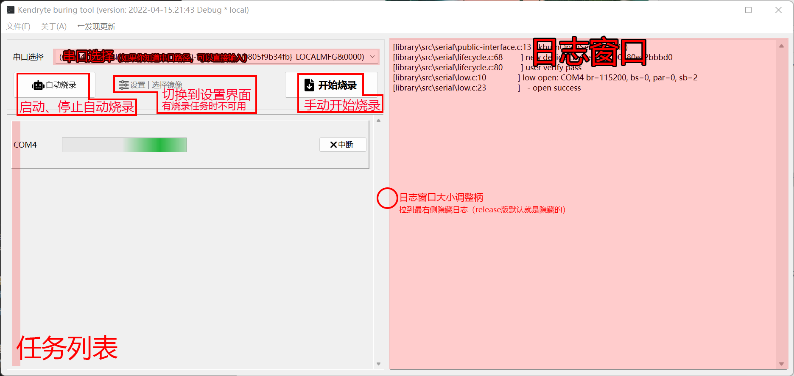
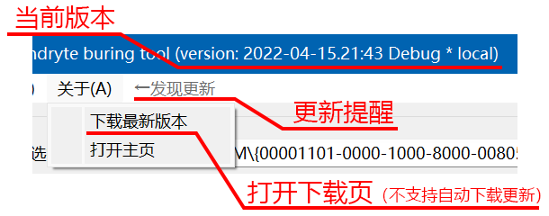

# 烧录工具使用手册
## 界面说明
### 主界面

### 设置界面

## 手动烧录
1. 选择要烧录的串口设备。
   * *如果你知道串口设备的路径，可以直接填写在文本框中*
2. 点击【开始烧录】。
3. 等待完成，如果想要中断，点击“中断”。注意：部分操作无法中断，将会等待这些操作结束。
4. 如果成功，需点击“确认”才能继续烧录。可以在设置中启用“自动确认手动添加的任务”实现自动确认。
5. 如果失败，点击“重试”（再次以相同参数烧录）或“确认”（放弃烧录）。

## 自动批量烧录
1. 点击【自动烧录】，按钮开始闪烁。
2. 准备好设备并上电，烧录过程将自动进行，成功后自动确认（可在设置界面中禁用，但同一端口无法响应新设备，不建议禁用）。
3. 如果失败，不会自动确认，可以在设置界面中启用“失败后也自动确认”，此时只能通过板上的led判断是否成功。
4. 默认监视ch341串口。如不是ch341，应在“设置界面→高级选项→设备监视设置”中修改对应vid、pid。不支持物理串口设备。

## 自动更新检测
程序启动后将在空闲时查询最新版本信息，如果发现新版本，则会在菜单栏提醒。

程序不会自动更新自己，需要手动下载。

请务必使用最新版本。

## 日志和求助

如果发生问题，请对有问题的界面截图
* Win7、8：打开开始菜单，找到“截图工具”
* Win10以上：<kbd>Win</kbd>+<kbd>Shift</kbd>+<kbd>S</kbd>

**同时**，点击“文件→保存日志”（或按下<kbd>Ctrl</kbd>+<kbd>S</kbd>），选择一个地方保存（例如桌面），然后把这个文件一起发送给支持人员。
